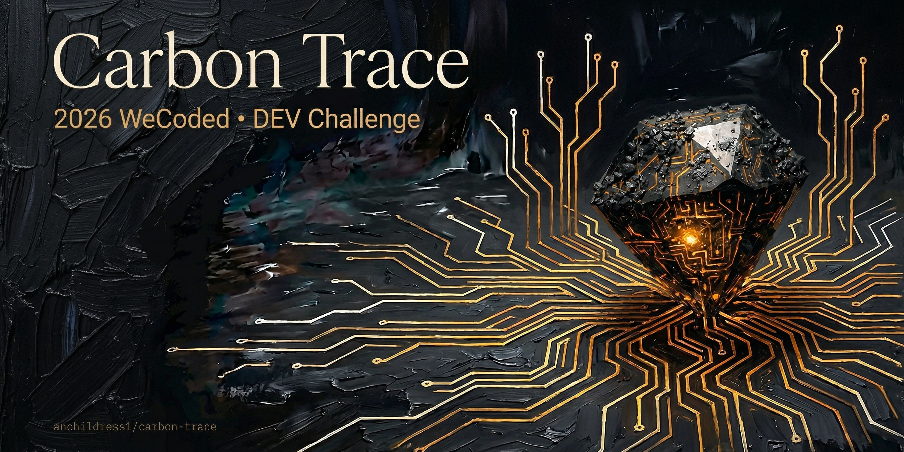

# Carbon Trace: An Immersive Art Experience

[](https://github.com/anchildress1/carbon-trace/actions/workflows/ci.yml) [](LICENSE) [](https://sonarcloud.io/project/overview?id=anchildress1_carbon-trace) [](https://sonarcloud.io/project/overview?id=anchildress1_carbon-trace)

An immersive visual narrative told from the awareness of a diamond trapped in a coal seam — 12 painted scenes with ghost-drift text, narrated audio, and pixel-level visual effects. Built for [WeCoded 2026 DEV Challenge](https://dev.to/devteam/join-the-2026-wecoded-challenge-and-celebrate-underrepresented-voices-in-tech-through-writing--4828) Frontend Art.

**[Experience it live](http://carbon-trace.anchildress1.dev)**

## The Story 💎

A diamond wakes up inside a coal seam. It doesn't know what it is yet — just pressure, darkness, and the sense that something isn't right. Over 12 scenes it moves through tunnels, furnaces, pockets, sinks, and silence. It gets carried, stored, forgotten, and found again. By the end, it isn't just a diamond anymore. It's a circuit. It's music. It's light.

The narrative follows a carbon cycle that isn't chemistry — it's personal. Coal to diamond to circuit to light. Each scene is a painted image (Leonardo AI, Flux 2 Pro) with narration I recorded, ambient textures, ghost-drift text that pours in and blows out like breath, and pixel-level effects that make the painted world actually move. Water flows. Heat rises. Dust drifts. The images aren't static — they breathe.

This is a competition entry judged on **Creativity**, **Effective Use of Frontend Technology**, and **Aesthetic Outcome**. Everything below explains why I built it the way I did.

## Why These Tools 🧬

No framework. No component library. No build-time abstraction layer. This is ~20 DOM elements on a single page with a linear path. Adding React would be pure overhead — there's nothing to reuse, nothing to route, nothing to manage state for that a flat module can't handle.

The tools I reached for each solve one specific problem:

- **Canvas 2D** renders every scene image with `drawImage()` and gives me `getImageData()`/`putImageData()` access for future runtime trace rendering. CSS operates on element boxes, not pixels. I needed pixels from day one.
- **PixiJS** handles the visual effects layer — water displacement, heat shimmer, dust drift, glow, shockwave — on the GPU. I prototyped these with Canvas 2D Perlin displacement first. Too slow at full resolution. PixiJS runs the same displacement maps at 60fps via WebGL without me writing a single shader. It's scoped exclusively to the effects canvas; the scene canvas stays Canvas 2D.
- **GSAP** sequences the ghost-drift text — overlapping enter/exit timelines with per-line timing, blur, y-offset, and opacity. CSS keyframes can't fire callbacks mid-animation or sequence across elements. GSAP's `timeline()` is the workflow orchestrator.
- **Howler.js** runs three audio channels simultaneously — ambient loops, spoken narration, and music — with crossfade, mobile autoplay unlock, and `.fade()` out of the box. Raw Web Audio API would mean manual gain nodes. HTML5 `<audio>` is single-track with no mixing.
- **Vite** builds it. Fast HMR, ES modules, tree-shakes everything. Already knew it — no learning curve under deadline.

## Two Rendering Layers 🪞

Canvas is a black box to screen readers. That's the cost of pixel access. The mitigation: two layers.

**Canvas** (with `aria-hidden="true"`) handles everything visual — scene images, pixel effects, traces. **DOM overlay** (positioned absolute over canvas) handles everything semantic — narration text, captions, buttons, progress dots, all accessibility. GSAP animates DOM. `requestAnimationFrame` animates canvas. No crossover.

Screen readers never know there's a canvas. They see the DOM layer — `aria-live` narration announcements, labeled buttons, roving-tabindex progress dots, toggle states. The experience is fully keyboard-navigable and WCAG AA compliant. `prefers-reduced-motion` swaps ghost-drift for simple fades and disables canvas effects entirely.

Building an immersive visual art piece that's also accessible isn't a tradeoff. It's two layers.

## Controls 🎭

The narration drives the pacing — scenes auto-advance when narration ends. You can override that anytime.

| Control                 | Action                                               |
| ----------------------- | ---------------------------------------------------- |
| **Prev / Next** buttons | Navigate between scenes                              |
| **Arrow Left / Right**  | Navigate between scenes                              |
| **Space**               | Toggle play/pause                                    |
| **Enter / Arrow Right** | Advance to next scene                                |
| **Pause** button        | Freeze/resume all audio, animations, and captions    |
| **Mute** button         | Toggle audio mute                                    |
| **Captions** button     | Toggle subtitle display (persists across sessions)   |
| **Replay** button       | Restart current scene's narration from the beginning |
| **Progress dots**       | Jump to a specific scene                             |

## Getting Started 🪴

**Prerequisites:** Node.js 22 (pinned via [Volta](https://volta.sh)), pnpm

```bash
# Install dependencies
make install

# Start development server
make dev
```

## Updating Assets

All files in `public/assets/` carry an 8-char SHA-256 content hash in the filename for cache busting ([ADR-010](docs/ADRs/ADR-010-asset-content-hashing.md)). When you update an image, mask, audio file, or font:

```bash
# Generate the hash
shasum -a 256 <file> | cut -c1-8

# Rename with the new hash (replace the old hash suffix)
# Then update references in src/scenes.json, src/styles.css, etc.
```

## Available Commands 🪄

| Command            | Description                       |
| ------------------ | --------------------------------- |
| `make install`     | Install all dependencies          |
| `make dev`         | Start development server          |
| `make format`      | Format code                       |
| `make lint`        | Run linter                        |
| `make typecheck`   | Type check (no-op for vanilla JS) |
| `make test`        | Run unit tests                    |
| `make build`       | Production build                  |
| `make e2e`         | Run E2E tests                     |
| `make perf`        | Run performance tests             |
| `make secret-scan` | Scan for secrets                  |
| `make clean`       | Remove build artifacts            |

## Deeper Docs 🔮

- [Architecture](docs/architecture.md) — module graph, state machine, frame lifecycle, deployment pipeline
- [Accessibility](docs/accessibility.md) — screen reader support, keyboard nav, reduced motion, captions, ARIA
- [Audio System](docs/audio-system.md) — 3-channel mixer, buffer recovery, crossfade, pause/resume math
- [ADRs](docs/ADRs/) — every architectural decision and why, from foundational architecture to audio-reactive effects

## Built With 🪸

- [Leonardo AI](https://leonardo.ai) (Flux 2 Pro) — painterly scene images
- [GSAP](https://gsap.com) — DOM animation and timeline sequencing
- [Howler.js](https://howlerjs.com) — audio playback and mixing
- [PixiJS](https://pixijs.com) — GPU-accelerated visual effects
- [Vite](https://vite.dev) — build tooling
- Deployed via [Cloud Run](https://cloud.google.com/run) + nginx + GitHub Actions

## License 🛡️

Polyform Shield License 1.0.0 — see [LICENSE](LICENSE).
