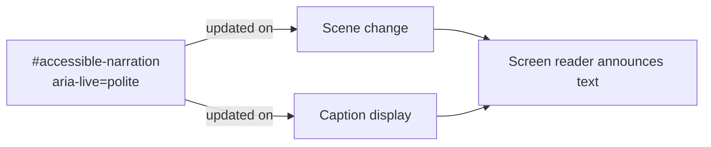
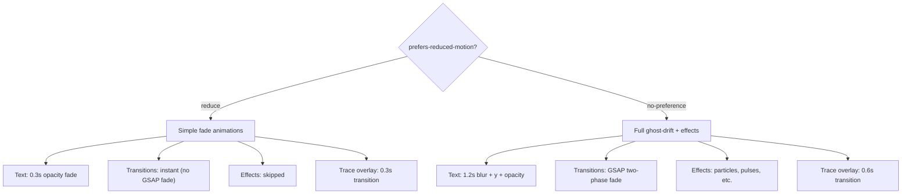
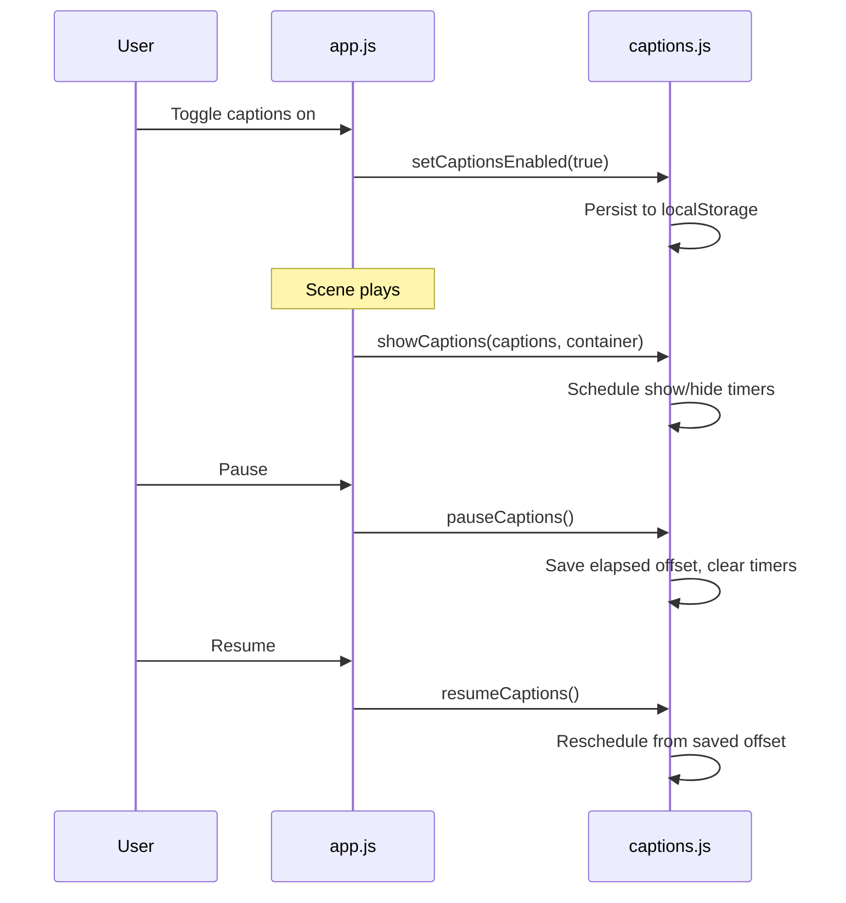

# Accessibility

## Screen Reader Support



A persistent `aria-live="polite"` region (`#accessible-narration`) receives the
full narration text for each scene. Screen readers announce the content as it
changes without interrupting the user.

The ghost-drift narration layer and caption layer are both marked
`aria-hidden="true"` because they are visual-only presentations of the same
content that `#accessible-narration` provides to assistive technology.

## Keyboard Navigation

| Key | Action |
|-----|--------|
| `Space` | Toggle play/pause |
| `Enter` / `ArrowRight` | Advance to next scene |
| `ArrowLeft` | Return to previous scene |
| `Tab` | Navigate between controls |

Space toggles play/pause (not advance). Enter and ArrowRight advance to the
next scene. All control buttons (prev, pause, mute, captions, replay, next)
are focusable and respond to keyboard activation. Space and Enter/ArrowRight
do not fire when focus is inside the control bar to avoid conflicting with
button activation.

## Focus Management

- All interactive elements have visible focus indicators: 2px white outline at
  -2px offset.
- Disabled buttons (`aria-disabled="true"` or `disabled` attribute) have
  reduced opacity (0.3) and do not respond to interaction.
- Progress dots are buttons with `aria-label="Go to scene N of M"`.

## ARIA Attributes

| Element | Attribute | Purpose |
|---------|-----------|---------|
| `#app` | `role="application"` | Declares app-managed keyboard handling |
| `#accessible-narration` | `aria-live="polite"` | Announces narration text |
| `#narration-layer` | `aria-hidden="true"` | Hides decorative ghost-drift text |
| `#caption-layer` | `aria-hidden="true"` | Hides visual captions (content in live region) |
| `#btn-pause` | `aria-pressed` | Toggle state for pause/play |
| `#btn-captions` | `aria-pressed` | Toggle state for captions on/off |
| `#btn-mute` | `aria-label` | Updates between "Mute audio" / "Unmute audio" |
| `#btn-mute` | `aria-disabled` | Disabled until audio is available |
| `#scene-stage` | `aria-label` | Scene description from `frame.description` |
| progress dots | `aria-current="step"` | Identifies the current scene dot |

## Reduced Motion

When `prefers-reduced-motion: reduce` is active:



| Feature | Normal | Reduced Motion |
|---------|--------|----------------|
| Ghost-drift text | Blur + y offset + opacity (1.2s in, 0.9s out) | Opacity only (0.3s) |
| Scene transitions | Two-phase GSAP fade | Instant swap |
| Visual effects | Full particle/filter effects | Skipped entirely |
| Trace overlay | 0.6s opacity transition | 0.3s opacity transition |

The `prefersReducedMotion()` check is evaluated at the point of use (not
cached), so it responds to runtime changes in the user's system preference.

## Caption System



Captions are timed to narration playback using `start`/`end` timestamps in
milliseconds. When paused, the elapsed playback time is saved. On resume,
all caption timers are recalculated from the saved offset, keeping captions
synchronized with audio.

Toggling captions mid-scene recalculates from the current text timeline
position, so captions appear at the correct point regardless of when they were
enabled.

The caption preference is persisted in `localStorage` under the key
`carbon-trace-captions-enabled`.

## Content Security Policy

The CSP meta tag restricts resource loading:

```
default-src 'self'
script-src  'self'
style-src   'self' 'unsafe-inline' https://fonts.googleapis.com
img-src     'self'
media-src   'self' data:
font-src    'self' https://fonts.gstatic.com
connect-src 'none'
object-src  'none'
base-uri    'self'
```

`connect-src` is relaxed to `'self' ws:` during development to allow Vite HMR
WebSocket connections (handled by the `relax-csp-dev` Vite plugin).

## Progressive Enhancement

The Google Fonts stylesheet is loaded via `<link rel="preload" as="style">`
and activated by JavaScript in `main.js`. A `<noscript>` fallback ensures the
Lora font loads even when JavaScript is disabled.
