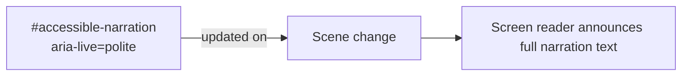
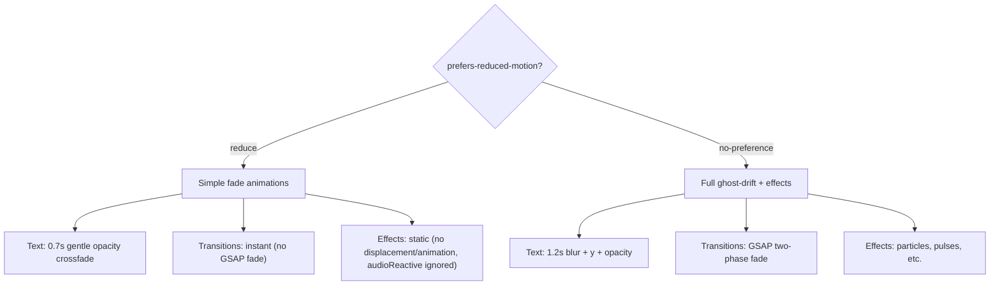
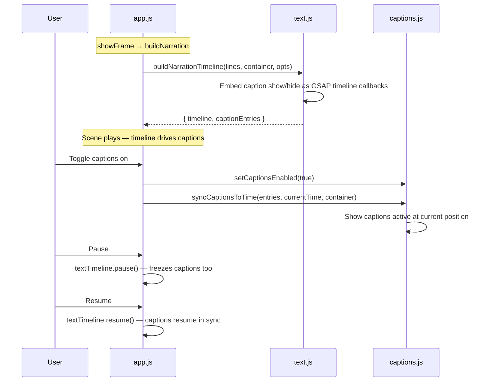

# Accessibility ♿

The entire visual experience runs on a `<canvas>`. Canvas is invisible to assistive technology — it's a bitmap, not a DOM tree. That's the tradeoff for pixel-level effects. So the accessibility strategy is architectural, not bolt-on: a DOM overlay sits on top of the canvas and carries all semantic content. Screen readers see the overlay. The canvas doesn't exist to them. Every narration line, every button, every navigation dot lives in the DOM layer. The visual art is for eyes; the DOM is for everything else.

## Screen Reader Support 🗣️



A persistent `aria-live="polite"` region (`#accessible-narration`) receives the
full narration text for each scene on scene change. When captions are available,
their text is used; otherwise narration line text is joined. Screen readers
announce the content as it changes without interrupting the user.

The ghost-drift narration layer and caption layer are both marked
`aria-hidden="true"` because they are visual-only presentations of the same
content that `#accessible-narration` provides to assistive technology.

## Keyboard Navigation ⌨️

| Key                    | Action                                  |
| ---------------------- | --------------------------------------- |
| `Space`                | Toggle play/pause                       |
| `Enter` / `ArrowRight` | Advance to next scene                   |
| `ArrowLeft`            | Return to previous scene                |
| `Escape`               | Pause (one-directional — never resumes) |
| `Tab`                  | Navigate between controls               |

Space toggles play/pause (not advance). Enter and ArrowRight advance to the
next scene. Escape always pauses; Space resumes. All control buttons (prev,
pause, mute, captions, replay, next) are focusable and respond to keyboard
activation. Space and Enter are suppressed when focus is on a button element,
allowing native button activation. Arrow keys always navigate scenes
regardless of focus location, except when focus is on a progress dot (see
below).

Keyboard shortcuts are defined declaratively in `keyboard.js` via a key-action
map. The module exports `handleKeydown` (pure function for testing) and
`initKeyboard` (document listener registration with cleanup).

## Focus Management 🎯

- All interactive elements have visible focus indicators: 2px white outline at
  -2px offset.
- Disabled buttons (`aria-disabled="true"` or `disabled` attribute) have
  reduced opacity (0.3) and do not respond to interaction.
- Progress dots are buttons with `aria-label="Go to scene N of M"`.
- Keyboard navigation (arrow keys, Enter) does **not** redirect focus to the
  active dot — this preserves "global navigation mode" for sequential
  browsing. Pointer-initiated navigation (button/dot clicks) redirects focus
  to the active dot.

### Progress Dots — Roving Tabindex 🔘

The progress dot group is a composite widget following the WAI-ARIA toolbar
pattern:

- **Single Tab stop**: the dot group occupies one position in the Tab order.
  Only the roving-target dot has `tabindex="0"`; all others have
  `tabindex="-1"`.
- **Arrow keys**: Left/Right/Up/Down move focus between dots with wrap-around.
  Home/End jump to first/last dot. Arrow keys within the dot group call
  `stopPropagation` to prevent global scene navigation.
- **Enter/Space on a focused dot**: triggers navigation to that dot's scene
  via the dot's click handler (native button activation).
- **Focus ring vs active dot**: focus ring (keyboard highlight) and active
  state (filled dot indicating the current scene) are independent. A user can
  arrow-focus to any dot and press Enter to jump there.

## ARIA Attributes 🏷️

| Element                 | Attribute             | Purpose                                        |
| ----------------------- | --------------------- | ---------------------------------------------- |
| `#app`                  | `role="application"`  | Declares app-managed keyboard handling         |
| `#accessible-narration` | `aria-live="polite"`  | Announces narration text                       |
| `#narration-layer`      | `aria-hidden="true"`  | Hides decorative ghost-drift text              |
| `#caption-layer`        | `aria-hidden="true"`  | Hides visual captions (content in live region) |
| `#btn-pause`            | `aria-pressed`        | Toggle state for pause/play                    |
| `#btn-captions`         | `aria-pressed`        | Toggle state for captions on/off               |
| `#btn-mute`             | `aria-label`          | Updates between "Mute audio" / "Unmute audio"  |
| `#btn-mute`             | `aria-disabled`       | Disabled until audio is available              |
| `#scene-stage`          | `aria-label`          | Scene description from `frame.description`     |
| progress dots           | `aria-current="step"` | Identifies the current scene dot               |

## Reduced Motion 🧘

When `prefers-reduced-motion: reduce` is active:



| Feature                   | Normal                                        | Reduced Motion                                                |
| ------------------------- | --------------------------------------------- | ------------------------------------------------------------- |
| Ghost-drift text          | Blur + y offset + opacity (1.2s in, 0.9s out) | Gentle opacity crossfade (0.7s in/out, eased)                 |
| Scene transitions         | Two-phase GSAP fade                           | Instant swap                                                  |
| Visual effects            | Full displacement + particle effects          | Static: no displacement, no animation (ADR-007)               |
| Audio-reactive modulation | Effect parameters driven by music FFT data    | Ignored — base parameter values used, no modulation (ADR-008) |

The `prefersReducedMotion()` check is evaluated at the point of use (not
cached), so it responds to runtime changes in the user's system preference.

## Caption System 💬



Caption show/hide scheduling is embedded directly in the GSAP text timeline
built by `text.js`. Each caption's `start`/`end` timestamps (offset by
`narration.delay`) become `tl.call()` entries that create and remove caption
DOM elements. Because captions live inside the same timeline as narration
text, they automatically pause and resume with it — no separate timer math.

Toggling captions mid-scene calls `syncCaptionsToTime`, which scans caption
entries and immediately shows any that should be visible at the current
timeline position.

The caption preference is persisted in `localStorage` under the key
`carbon-trace-captions-enabled`.

## Credits Overlay (ADR-011)

The credits panel on frame 11 follows the same two-layer accessibility model as the rest of the experience:

| Element | ARIA | Purpose |
|---------|------|---------|
| `#credits-panel` | `<section aria-label="Credits">` (implicit `region`) | Named landmark region for screen readers |
| Section headings | `<h2>` | Screen reader structure within credits |
| Attribution links | `<a target="_blank" rel="noopener">` | Native links — tabbable, clickable, announced |

**Auto-scroll pause (WCAG 2.4.3):** Auto-scrolling credits pause when any link receives focus (Tab) or pointer hover. A resume timer (configurable via `resumeDelay` in scenes.json) restarts the scroll after idle. The resume timer does not fire while a link has focus, preventing focused content from scrolling off-screen.

**Reduced motion:** When `prefers-reduced-motion: reduce` is active, the credits panel appears instantly (no GSAP fade-in), auto-scroll is disabled, and the panel uses native `overflow-y: auto` for manual scrolling. The mask-image gradient feathering is removed so content isn't clipped during native scroll.

**Focus order:** `#credits-panel` sits inside `#scene-stage` (z-index 7). Overlay controls (z-index 10) are a sibling that paints after scene-stage by DOM order. Tab naturally moves from credits links to overlay controls — no focus trap.

**Pause interaction:** When the experience is paused, the scroll timeline freezes but wheel scrubbing and link interaction still work. The `isPaused` flag prevents auto-resume timers from restarting the scroll until the experience resumes.

## Content Security Policy 🔐

The CSP meta tag restricts resource loading:

```
default-src 'self'
script-src  'self'
style-src   'self' 'unsafe-inline'
img-src     'self'
media-src   'self' data:
font-src    'self'
connect-src 'none'
object-src  'none'
base-uri    'self'
```

`style-src` keeps `'unsafe-inline'` because narration positioning is applied via
runtime style attributes in `text.js` (for per-line x/y placement).

`connect-src` is relaxed to `'self' ws:` during development to allow Vite HMR
WebSocket connections (handled by the `relax-csp-dev` Vite plugin).

## Progressive Enhancement 🌱

Lora is self-hosted under `/assets/fonts/` and loaded via `@font-face` in
`src/styles.css`. This removes third-party font dependencies while preserving
typography under strict CSP.
