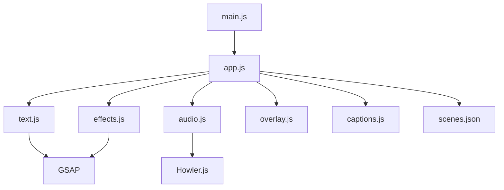
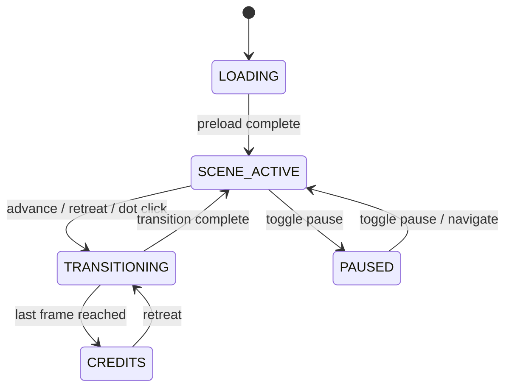

# Architecture

## Module Dependency Graph



## State Machine



Pause is blocked during `TRANSITIONING` and `LOADING`. Navigation from `PAUSED` clears pause state before transitioning.

## Frame Lifecycle

1. **Preload** — `preloadAssets()` loads all images and audio in parallel via `Promise.all`
2. **showFrame()** — Sets image, alt text, trace overlay opacity; clears effects and narration
3. **applyNarration()** — Builds GSAP text timeline from `narration.lines[]`, schedules audio with delay, shows captions, populates `#accessible-narration`
4. **applyAmbient()** — Plays or crossfades ambient audio (currently null on all scenes)
5. **runEffect()** — Starts idle and entry visual effects on the effects layer
6. **transition()** — GSAP fade out → showFrame() → fade in, guarded by `TRANSITIONING` state

## Data Flow

```
scenes.json → applyFrameDefaults() → app.frames[]
                                         │
                    ┌────────────────────┬┴───────────────────┐
                    ▼                    ▼                    ▼
            narration.lines[]    narration.captions[]   narration.audio
                    │                    │                    │
                    ▼                    ▼                    ▼
          buildTextTimeline()    showCaptions()      scheduleNarrationAudio()
          (GSAP ghost-drift)    (timed DOM elements)  (Howler.js playback)
                    │                    │                    │
                    ▼                    ▼                    ▼
           .narration-layer      .caption-layer       audio output
           (positioned text)     (subtitles)
```

## Overlay Text vs Captions

|               | Overlay Text                 | Captions                          |
| ------------- | ---------------------------- | --------------------------------- |
| Content       | Short poetic fragments       | Full spoken transcription         |
| Positioning   | Absolute x/y with alignment  | Centered bottom, dark background  |
| Rendering     | Ghost-drift animation (GSAP) | Timed show/hide (setTimeout)      |
| Screen reader | Not used                     | Populates `#accessible-narration` |
| `aria-hidden` | Yes (narration-layer)        | Yes (caption-layer)               |

## Interaction Model

- **Navigation**: Prev/Next buttons, Arrow keys, Space, Enter, progress dots
- **Effects**: Click/hover on scene area triggers visual effects (not navigation)
- **Pause**: Freezes audio, GSAP timelines, caption timers, effect tweens
- **Replay**: Restarts narration text, audio, and captions from t=0
- **Mute**: Toggles Howler.js mute on all active audio
- **Captions**: Toggle on/off, persisted to localStorage
