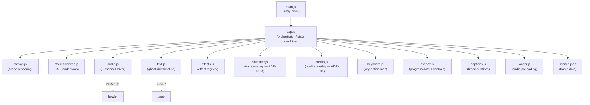
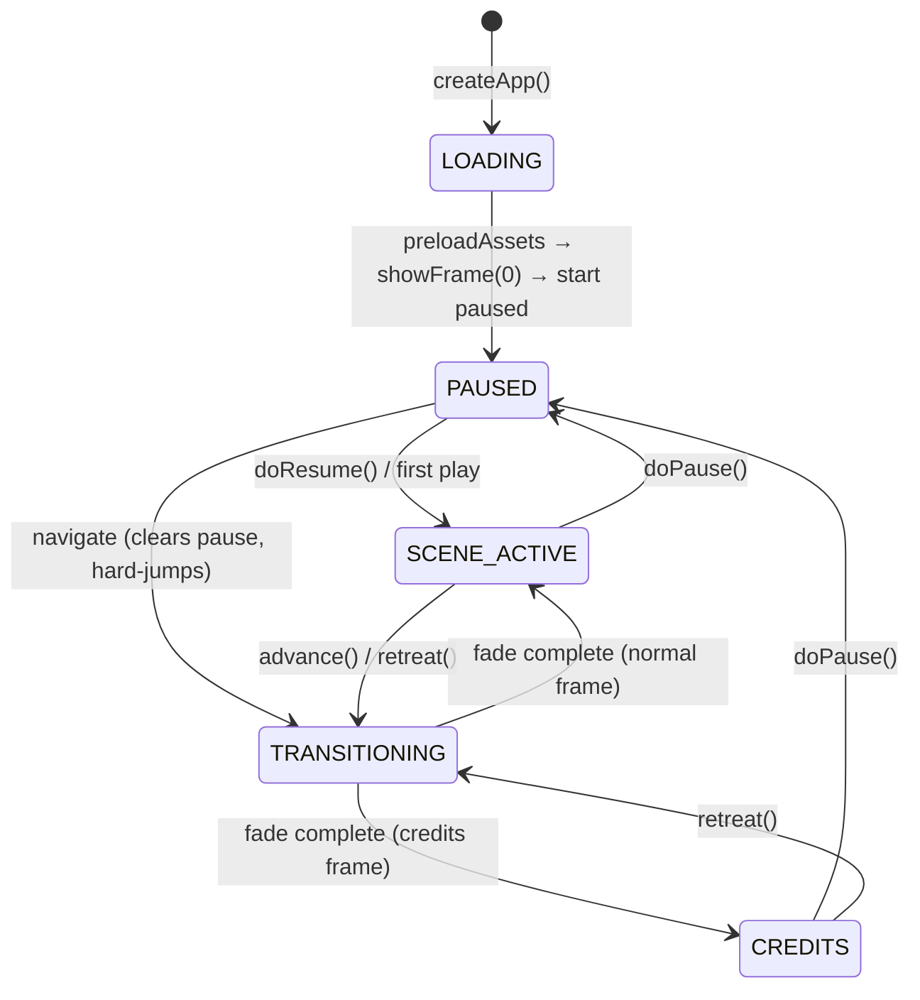
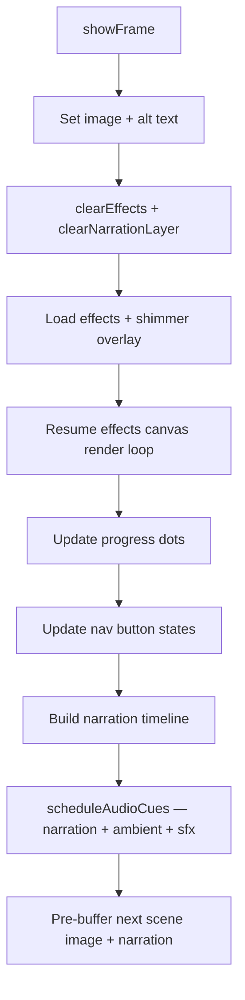
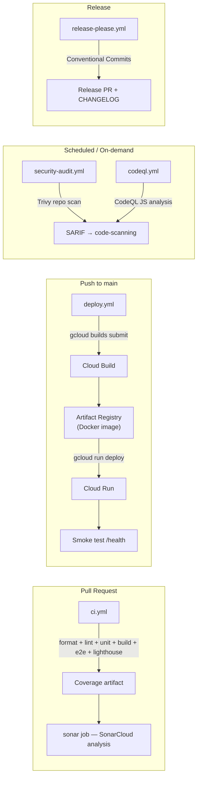

# Architecture 🏛️

One orchestrator. Flat modules. Config as data. Every scene shares the same schema shape — same keys, same types. `null` means "skip this feature." Scene differences live in `scenes.json`, not in `if`-blocks. The orchestrator (`app.js`) is the only module that knows frame ordering. Everything else receives config objects and does its one job.

## Module Graph 🕸️



## State Machine 🎰



## Frame Lifecycle 🔄

When a frame becomes active, `showFrame(index)` runs this sequence:



### buildNarration

1. Build ghost-drift text timeline from `frame.narration.lines` via
   `buildNarrationTimeline`, which also embeds caption show/hide calls
   directly into the GSAP timeline.
2. Populate `#accessible-narration` for screen readers (prefers captions
   text when available, falls back to narration lines).

### scheduleFrameAudio

All audio for a frame is scheduled through the unified `scheduleAudioCues`
API (ADR-005). The frame's `audioCues[]` array contains narration, ambient,
and sfx cues — each with an `enter` time (absolute ms or anchor-based).
Music is modeled as an ambient cue with anchor-based entry (e.g.,
`enter: { ref: "narration", offset: -12000 }`). Replay does not restart
music — only the narration cue is targeted.

## Modules 🧩

### app.js (orchestrator)

Single source of truth for application state. Owns the `app` object containing
`currentIndex`, `state`, all timer references and their remaining values for
pause/resume, the GSAP text timeline, and DOM element references. Every user
interaction (click, keyboard, button) routes through `app.js` functions.

Key responsibilities:

- Asset preloading (first-frame blocking, background sequential).
- Scene transitions with GSAP two-phase fade and error boundary.
- Pause/resume: saves elapsed time for every active timer, pauses text
  timeline and captions, suspends all audio channels.
- Buffering overlay: pauses text and captions when narration stalls, resumes
  when buffer recovers.

### audio.js (3-channel mixer)

Three audio cue types: ambient (looping background, crossfade on transition),
narration (one-shot per scene, drives auto-advance), and sfx (one-shot, no
crossfade). Music is modeled as an ambient cue with anchor-based entry.
See [audio-system.md](audio-system.md) for full details.

### text.js (ghost-drift animation)

Builds a GSAP timeline from narration lines. Each line is a `<p>` in the
narration layer with timed entrance and exit animations. Supports precise
viewport-relative positioning (`x`/`y` in %) with fixed alignment handled by
CSS. Falls back to simple opacity fade when `prefers-reduced-motion` is active.

### effects.js (PixiJS effect factory) 🦾

Registry of named effect types, each backed by a factory function that creates
a PixiJS filter and an update callback. `effects-canvas.js` calls `createEffect()`
to instantiate filters per scene.

Five built-in effect types:

- **Displacement-based** (`water`, `heat`, `dust`) — use PixiJS `DisplacementFilter`
  with a noise sprite. Each produces per-region pixel displacement at 60fps on the GPU.
- **Extension effects** (`glow`, `shockwave`) — use `GlowFilter` and `ShockwaveFilter`
  from `pixi-filters`. No noise sprite required.

Frames declare effect regions in `scenes.json` with mask images, direction, speed,
intensity, and scale. The effects canvas composites these as a transparent overlay
on top of the Canvas 2D scene image — only the masked regions show effects. Everything
outside the masks is transparent, so the static painted image shows through underneath.

### captions.js (timed subtitles)

Manages caption preference persistence (`localStorage`) and provides
`syncCaptionsToTime` for mid-scene caption sync when toggling captions on.
Caption show/hide scheduling is embedded in the GSAP timeline built by
`text.js`, not driven by separate timers. See [accessibility.md](accessibility.md)
for integration details.

### keyboard.js (key-action map)

Declarative mapping from `KeyboardEvent.key` values to action strings. Each
entry specifies `preventDefault` behavior and whether the key is allowed when
focus is on a `<button>` (the button guard). The pure `handleKeydown` function
is testable without DOM setup. `initKeyboard` registers the document listener
and returns a cleanup function. The module does not import any app functions —
it receives an action handler callback.

### overlay.js (progress + controls)

Creates one progress dot button per scene. Dots light up as the user advances.
Clicking a dot navigates to that scene. The dot group uses roving tabindex
(single Tab stop, arrow keys move focus between dots, Enter/Space activates).
The control bar contains prev, pause, mute, captions, replay, and next buttons.

## scenes.json Schema 📜

```
meta:
  title, author, aspectRatio
  defaultTransition: { type, duration }
  defaultHoldAfterNarration: ms (fallback for frames without explicit hold)
  frameDefaults: { textMode }

frames[]:
  id, frameType ("title" | "scene" | "credits"), description, image
  holdAfterNarration: ms after narration ends before auto-advance
  narration:
    lines[]: { text, enter (ms), exit (ms), x? (%), y? (%) }
    captions[]: { text, start (ms), end (ms) }
  audioCues[]: (ADR-003/ADR-005)
    { id, type ("narration"|"ambient"|"sfx"), src, enter (ms | anchor), volume, loop, fadeIn, fadeOut }
    anchor form: { ref: "<cue-id>", offset: <ms> }
  traceOverlay: (ADR-006A)
    { mask, opacity, color, dotCount, dotSpeed }
  effects:
    regions[]: { type, mask, direction, speed, intensity, scale, audioReactive? }
  transition: { type, duration }
```

## Deployment 🚀



### Workflows 🏗️

| Workflow             | Triggers                             | Purpose                                                                                       |
| -------------------- | ------------------------------------ | --------------------------------------------------------------------------------------------- |
| `ci.yml`             | PR (non-draft)                       | Format check, lint, unit tests + coverage, build, E2E (chromium), Lighthouse, SonarCloud scan |
| `deploy.yml`         | Push to `main`, manual               | Cloud Build → Artifact Registry → Cloud Run deploy + smoke test                               |
| `security-audit.yml` | PR, schedule (twice monthly), manual | Trivy repo scan for misconfig/secrets/licenses (HIGH+CRITICAL)                                |
| `codeql.yml`         | PR, schedule, manual                 | GitHub CodeQL JavaScript analysis                                                             |
| `release-please.yml` | Push to `main`                       | Automated release PR and CHANGELOG from Conventional Commits                                  |

### Docker Build 🐳

Multi-stage Dockerfile: `node:22-alpine` builder runs `pnpm build`, then `nginx:1-alpine` serves `dist/` on port 8080 with HEALTHCHECK and non-root `nginx` user. Cloud Build runs the Docker build via `gcloud builds submit`.

### Cloud Run ☁️

Deployed via `gcloud run deploy` with `--allow-unauthenticated` and `--cpu-boost`. Authentication uses Workload Identity Federation (OIDC) via the `deploy` GitHub environment — no long-lived service account keys.
