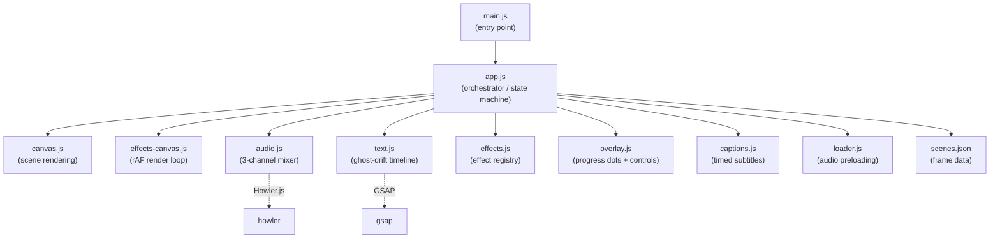
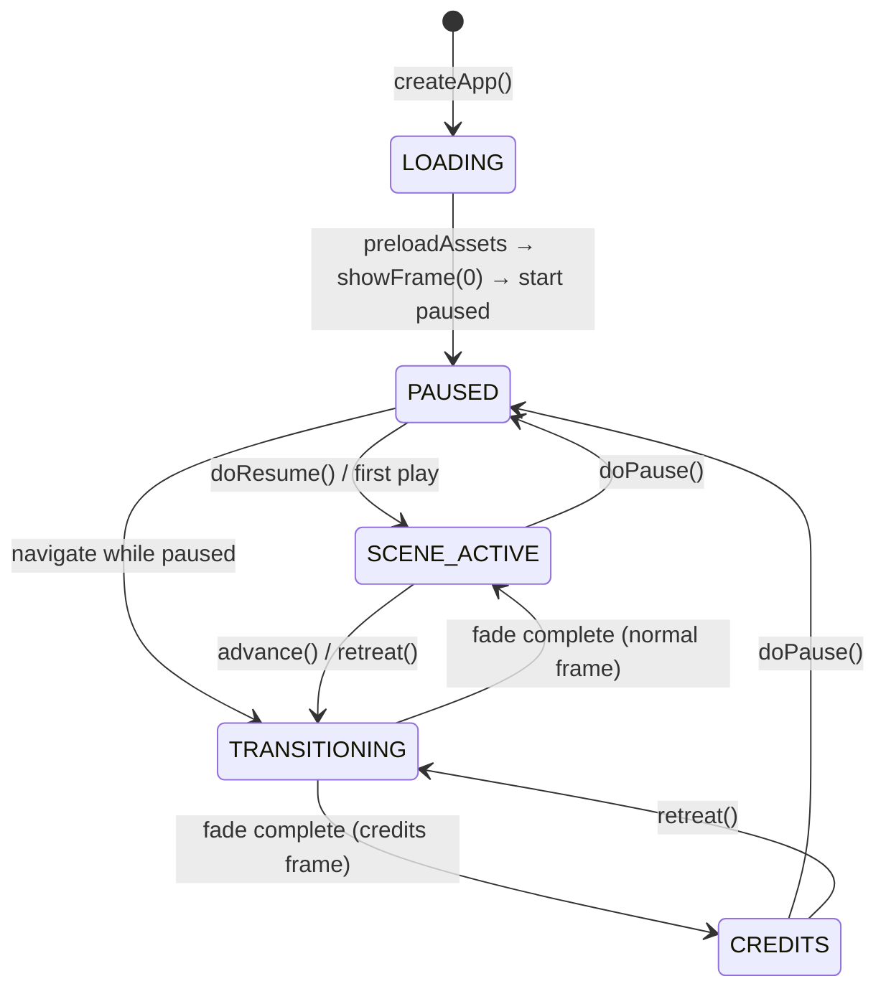
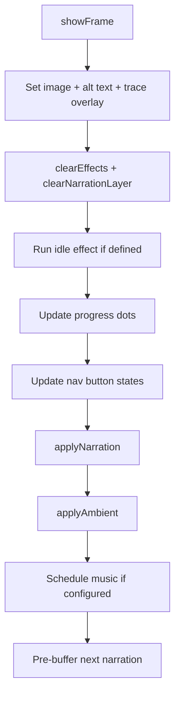
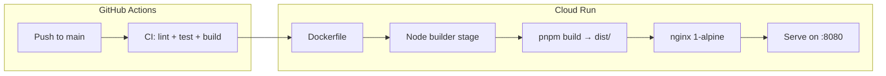

# Architecture

## Module Graph



## State Machine



## Frame Lifecycle

When a frame becomes active, `showFrame(index)` runs this sequence:



### applyNarration

1. Clear pending narration timer and caption delay timer.
2. Build ghost-drift text timeline from `frame.narration.lines`.
3. Show captions via `scheduleCaptionDisplay` (respects `narration.delay`).
4. Populate `#accessible-narration` for screen readers.
5. Schedule narration audio (with optional delay).

Music scheduling is handled separately in `showFrame`, not inside
`applyNarration`. Music is an independent audio track with its own
enter/exit timing — it starts when configured, fades as configured,
and plays until configured end. Replay does not restart music.

## Modules

### app.js (orchestrator)

Single source of truth for application state. Owns the `app` object containing
`currentIndex`, `state`, all timer references and their remaining values for
pause/resume, the GSAP text timeline, and DOM element references. Every user
interaction (click, keyboard, button) routes through `app.js` functions.

Key responsibilities:
- Asset preloading (first-frame blocking, background sequential).
- Scene transitions with GSAP two-phase fade and error boundary.
- Pause/resume: saves elapsed time for every active timer, pauses text
  timeline and captions, suspends all audio channels.
- Buffering overlay: pauses text and captions when narration stalls, resumes
  when buffer recovers.

### audio.js (3-channel mixer)

Three independent Howler.js channels: ambient, narration, and music.
See [audio-system.md](audio-system.md) for full details.

### text.js (ghost-drift animation)

Builds a GSAP timeline from narration lines. Each line is a `<p>` in the
narration layer with timed entrance and exit animations. Supports custom
viewport positioning (`x`/`y` in vw/vh) and alignment. Falls back to simple
opacity fade when `prefers-reduced-motion` is active.

### effects.js (visual effects)

Registry of named effect functions. Currently a no-op skeleton — all scene
effect references (`dust-drift`, `heat-pulse`, etc.) are declared in
`scenes.json` but resolve to no-ops until canvas-based implementations are
added. The API surface (`effectExists`, `runEffect`, `clearEffects`) is stable;
`app.js` does not change when effects are wired in.

Frames declare `effects.idle` (persistent) and `effects.entry` (triggered on
scene entry or replay). Effects will receive the effects canvas and scene canvas
elements; see `effects-canvas.js` for the render loop.

### captions.js (timed subtitles)

Manages a caption timeline synchronized to narration playback.
See [accessibility.md](accessibility.md) for integration details.

### overlay.js (progress + controls)

Creates one progress dot button per scene. Dots light up as the user advances.
Clicking a dot navigates to that scene. The control bar contains prev, pause,
mute, captions, replay, and next buttons.

## scenes.json Schema

```
meta:
  title, author, aspectRatio
  defaultTransition: { type, duration }
  frameDefaults: { textMode }

frames[]:
  id, frameType ("title" | "scene" | "credits"), description, image
  holdUntilClick: true (wait for click) | false (auto-advance) | null (no advance, credits)
  holdAfterNarration: ms after narration ends before auto-advance
  narration:
    lines[]: { text, enter (ms), exit (ms), x?, y?, align? }
    captions[]: { text, start (ms), end (ms) }
    audio: path to .m4a
    delay: ms before narration starts
  ambient: { src, volume, loop }
  music: { src, startVolume, fullVolume, crescendoMs, enter, exit }
  effects: { idle, entry }
  traceOverlay: { opacity }
  transition: { type, duration }
```

## Deployment



- **Cloud Run**: multi-stage Docker build → nginx with gzip, security headers,
  and tiered cache (1yr immutable for hashed assets, 30d for media, no-cache
  for HTML). Deployed to an existing verified domain via GitHub Actions CI/CD.
