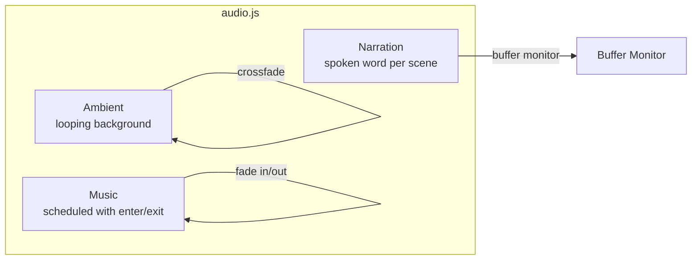
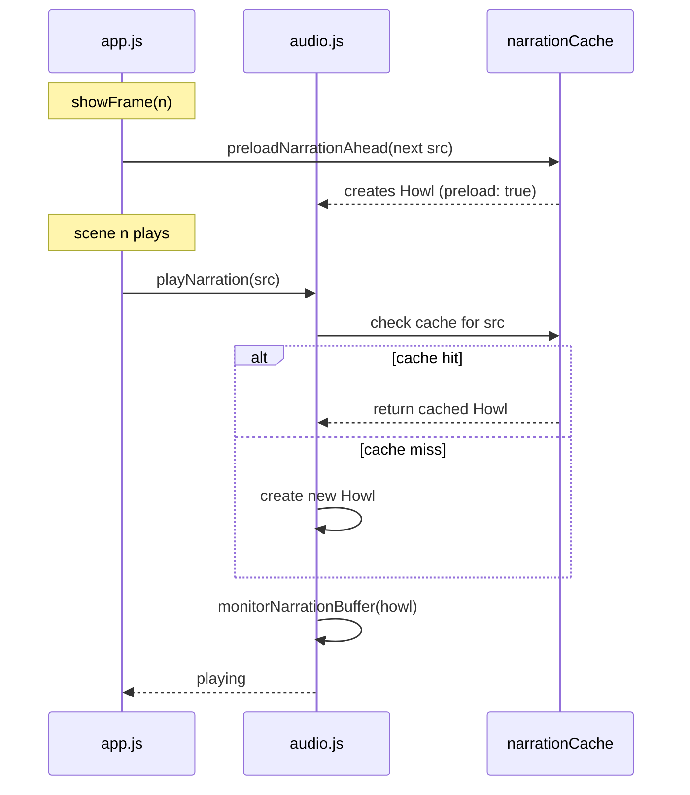
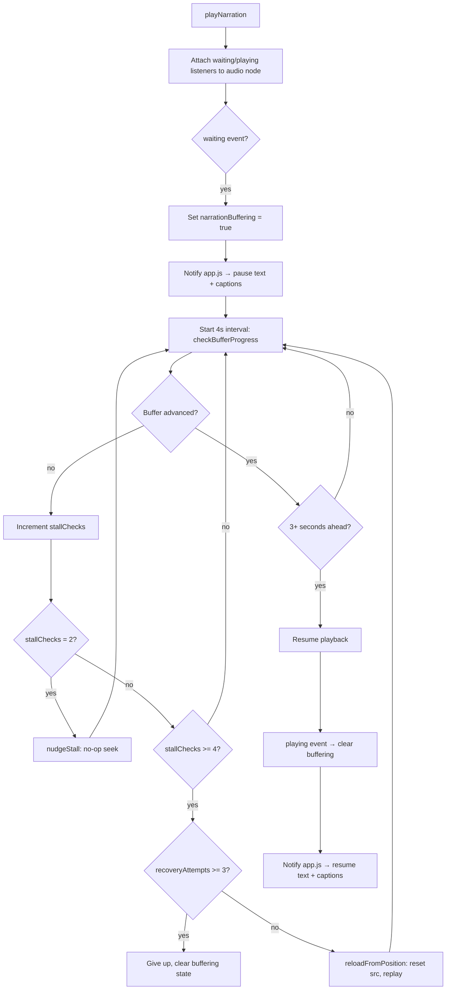
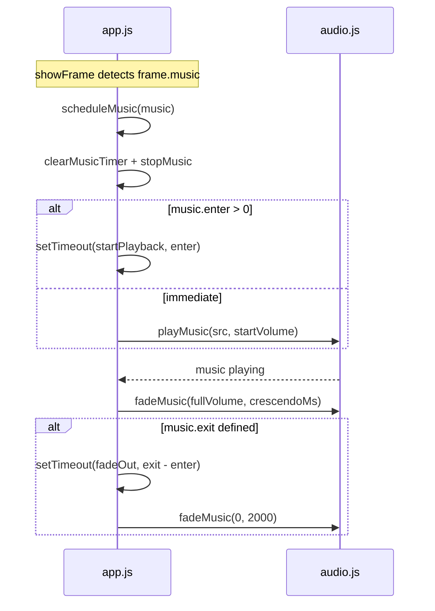

# Audio System

## Channels



Three independent Howler.js channels run concurrently:

| Channel | Behavior | Format | Loop |
|---------|----------|--------|------|
| **Ambient** | Crossfades between scenes (600–800ms) | mp3 | yes |
| **Narration** | One-shot per scene, supports delay | m4a (html5) | no |
| **Music** | Scheduled start/exit with volume crescendo | mp3 | yes |

All channels respect a global mute flag. Mute state is per-session (not persisted).

## Narration Lifecycle



### Pre-buffering

During each scene, `app.js` calls `preloadNarrationAhead()` for the next
scene's narration audio. This creates a Howl with `preload: true` so the
browser begins downloading the file in the background. When `playNarration()`
is called, it checks the cache first and reuses the pre-created Howl if
available.

The cache is cleared on every scene transition (`clearNarrationCache()`), then
the next scene's audio is queued.

## Buffer Monitoring & Stall Recovery



### Recovery Strategies

1. **nudgeStall** (after 2 stall checks): Seeks to the current position — a
   no-op that forces the browser to re-evaluate its buffer state.
2. **reloadFromPosition** (after 4 stall checks): Saves the current time,
   resets the `src` attribute, restores the position, and calls `play()`. If
   `play()` fails, buffering state is cleaned up immediately.
3. **Exhaustion** (after 3 reload attempts): Logs a warning and clears the
   buffering state so the UI is not permanently stuck.

### Buffering ↔ Pause Interaction

When `app.buffering` is true and the user has not manually paused:
- Text timeline is paused.
- Captions are paused (offset tracking preserved).

When the user manually pauses during buffering:
- Audio channels pause.
- The buffering spinner remains visible.
- On resume, text and captions only resume if buffering has cleared.

## Music Scheduling



Music is an independent audio track, separate from narration. It is scheduled
in `showFrame` (not `applyNarration`), so replaying narration does not restart
music. Music starts at the configured `enter` time, fades in over
`crescendoMs`, and plays until the configured `exit` time (or indefinitely if
`exit` is null).

Music supports:
- **Delayed start** (`enter` ms): Timer saved/restored on pause/resume.
- **Volume crescendo**: Starts at `startVolume`, fades to `fullVolume` over
  `crescendoMs`.
- **Scheduled exit** (`exit` ms): Triggers a 2-second fade to silence. The exit
  timer is independently tracked for pause/resume.
- **Independence from narration**: Music does not restart on replay. It
  functions like a narrated track — it starts when configured and runs on
  its own timeline.

## Ambient Crossfade

When transitioning between scenes, ambient audio crossfades:

1. New Howl created at volume 0, starts playing.
2. New ambient fades from 0 to target volume over the crossfade duration.
3. Old ambient fades from current volume to 0 over the same duration.
4. Old Howl unloaded after fade completes (+100ms buffer).

## Pause/Resume Timer Math

All scheduled timers (narration delay, music enter, music exit, phase duration)
use the same pattern:

```
On pause:
  elapsed = Date.now() - timerStart
  remaining = max(0, timerDelay - elapsed)
  clearTimeout(timer)

On resume:
  if (!remaining || remaining <= 0) return
  timerStart = Date.now()
  timerDelay = remaining
  timer = setTimeout(callback, remaining)
  remaining = null
```

On scene transition, all remaining values are reset to `null` to prevent
cross-scene timer leaks.

## Error Handling

Every Howl instance has `onloaderror` and `onplayerror` callbacks that:
- Log warnings to the console.
- Nullify the channel reference if the failed Howl is still current.

Buffer recovery clears the buffering state on `play()` failure to prevent the
UI from getting stuck in a permanent buffering spinner.
