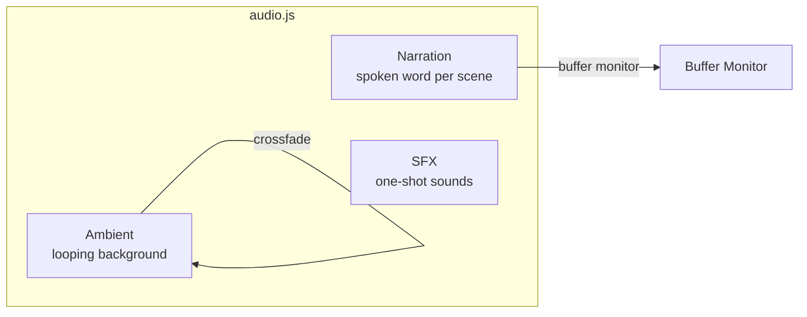
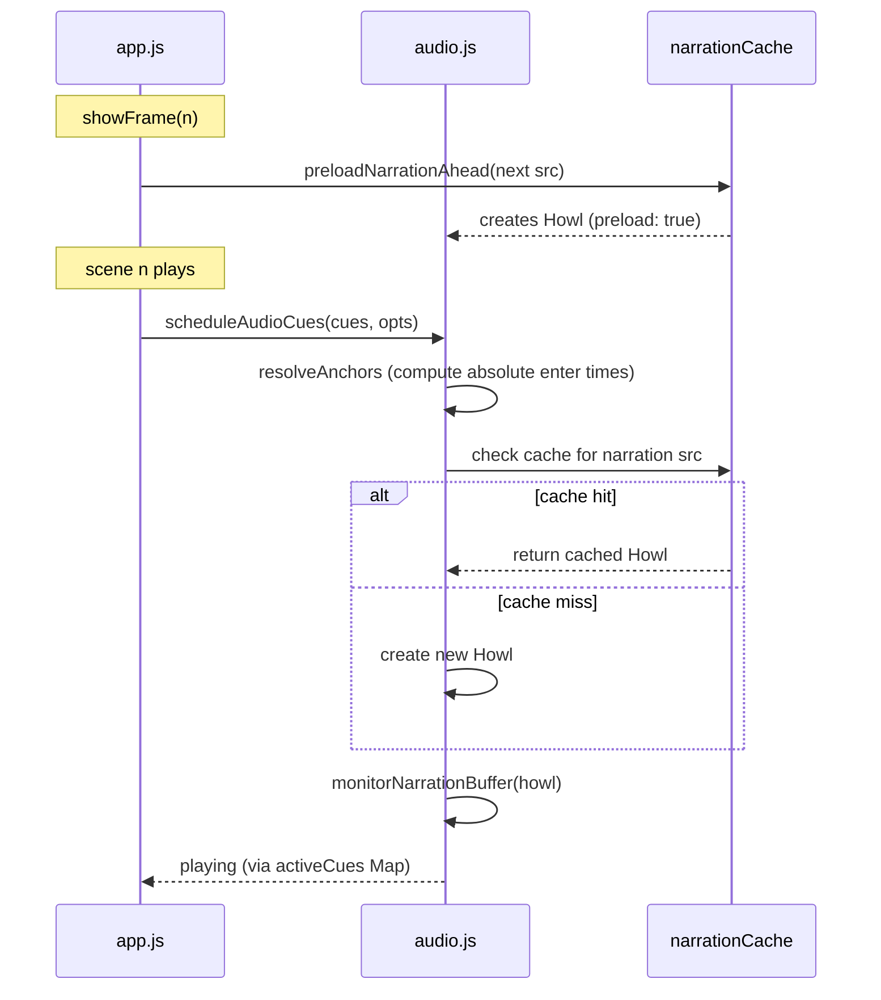
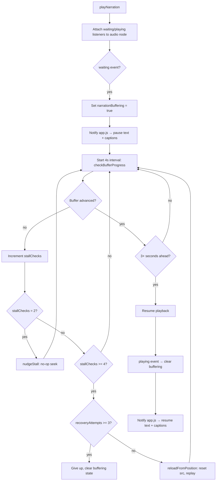
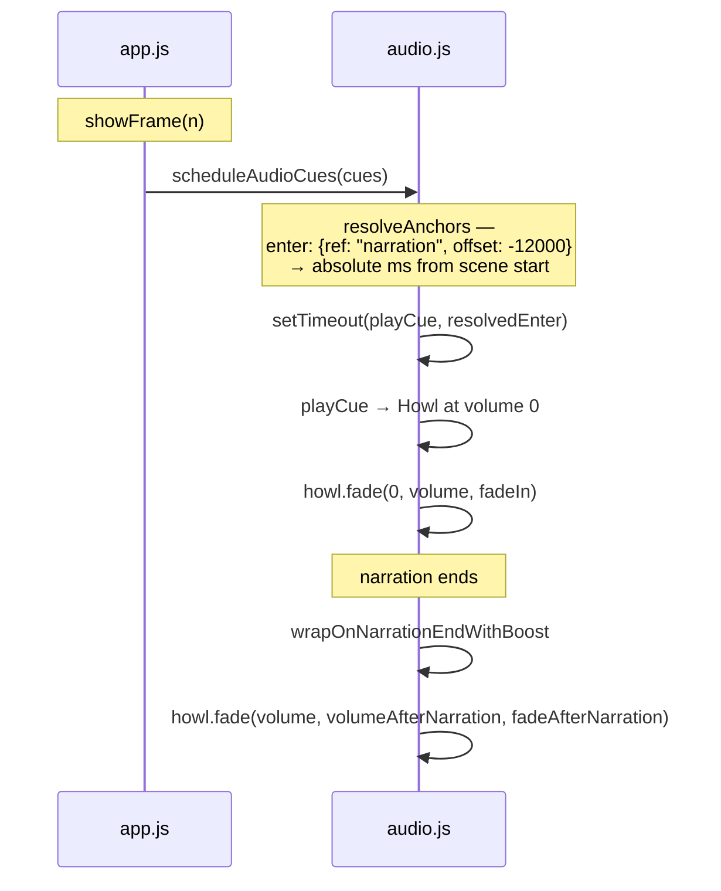

# Audio System 🎧

The narration is the pacing clock. When narration ends, the scene advances. When narration stalls, everything waits. Two audio cue types run concurrently — ambient and narration — and the system's job is to make sure none of them fail silently. If audio breaks, the experience should degrade gracefully (advance anyway), not hang forever on a scene that'll never fire its `end` event.

## Channels 🎛️



All audio is scheduled via the unified `audioCues[]` array in `scenes.json`
(ADR-003/ADR-005). The `scheduleAudioCues(cues, opts)` API replaces the
former separate ambient/narration/music slots. Three cue types:

| Cue type      | Behavior                                                                | Format                    | Loop |
| ------------- | ----------------------------------------------------------------------- | ------------------------- | ---- |
| **Ambient**   | Fades in over cue `fadeIn` duration; prior ambient fades out over 800ms | m4a (mp3 for music cues)  | yes  |
| **Narration** | One-shot per scene, fires `end` event for auto-advance                  | m4a (html5)               | no   |
| **SFX**       | One-shot, no crossfade, no replay                                       | mp3                       | no   |

Music is modeled as an ambient cue with anchor-based `enter` (e.g.,
`{ ref: "narration", offset: -12000 }`) — no dedicated music type.

All channels respect a global mute flag. Mute state is per-session (not persisted).

## Narration Lifecycle 🎙️



### Pre-buffering

During each scene, `app.js` calls `preloadNarrationAhead()` for the next
scene's narration audio. This creates a Howl with `preload: true` so the
browser begins downloading the file in the background. When `playNarration()`
is called, it checks the cache first and reuses the pre-created Howl if
available.

On each scene transition, cache entries are trimmed to keep only the current
scene narration and the prebuffered next-scene narration. This preserves
instant resume after paused navigation while preventing unbounded cache growth.

## Buffer Monitoring & Stall Recovery 🩺



### Recovery Strategies

1. **nudgeStall** (after 2 stall checks): Seeks to the current position — a
   no-op that forces the browser to re-evaluate its buffer state.
2. **reloadFromPosition** (after 4 stall checks): Saves the current time,
   resets the `src` attribute, restores the position, and calls `play()`. If
   `play()` fails, buffering state is cleaned up immediately.
3. **Exhaustion** (after 3 reload attempts): Logs a warning and clears the
   buffering state so the UI is not permanently stuck.

### Buffering ↔ Pause Interaction

When `app.buffering` is true and the user has not manually paused:

- Text timeline is paused.
- Captions are paused (offset tracking preserved).

When the user manually pauses during buffering:

- Audio channels pause.
- The buffering spinner remains visible.
- On resume, text and captions only resume if buffering has cleared.

## Music Scheduling 🎵

Music has no dedicated cue type — it is modeled as an `ambient` cue. The scene
data uses `type: "ambient"` with an anchor-based `enter` that schedules
playback relative to another cue's end time.



`resolveAnchors` computes the absolute start time by summing the referenced
cue's start time, its expected duration, and the offset. For example,
`enter: { ref: "narration", offset: -12000 }` starts the cue 12 seconds before
narration ends.

Music cue properties:

- **`enter`**: Anchor-based or absolute ms delay. Anchor form:
  `{ ref: "<cue-id>", offset: <ms> }`.
- **`fadeIn`**: Duration of the fade from 0 to `volume`.
- **`volumeAfterNarration`**: Volume to fade to once narration ends, handled by
  `wrapOnNarrationEndWithBoost`.
- **`fadeAfterNarration`**: Duration of the post-narration volume fade.
- **`loop: true`**: Loops indefinitely until the scene transitions.

## Ambient Crossfade 🌊

When transitioning between scenes while playing, ambient audio crossfades:

1. New Howl created at volume 0, starts playing.
2. New ambient fades from 0 to target volume over the crossfade duration.
3. Old ambient fades from current volume to 0 over the same duration.
4. Old Howl unloaded after fade completes (+100ms buffer).

When navigating while paused (hard cut), `cueAudioCues` creates Howls with
`preload: true` but does not call `play()`. They start when the user resumes
via `resumeAudioCues()`. This satisfies ADR-002's hard rule: no transient
playback during paused navigation.

## Pause/Resume Timer Math ⏱️

All scheduled timers use `PausableTimer` (ADR-005/ADR-009) — a standalone
utility in `src/pausable-timer.js` with built-in `pause()`, `resume()`, and
`cancel()` methods. Each audio cue in the `activeCues` Map has its own
`PausableTimer` instance for scheduling.

```
pauseAudioCues():
  iterate activeCues Map
  each entry's PausableTimer.pause() — saves remaining time internally

resumeAudioCues():
  iterate activeCues Map
  each entry's PausableTimer.resume() — reschedules with saved remaining

cancelAudioCues():
  iterate activeCues Map
  each entry's PausableTimer.cancel() + unload Howl
  clear the Map
```

On scene transition, `cancelAudioCues()` clears all entries to prevent
cross-scene timer leaks. Auto-advance also uses a `PausableTimer` owned
by `app.js`.

## Error Handling 🪤

Every Howl instance has `onloaderror` and `onplayerror` callbacks that:

- Log warnings to the console.
- Nullify the channel reference if the failed Howl is still current.

Buffer recovery clears the buffering state on `play()` failure to prevent the
UI from getting stuck in a permanent buffering spinner.
