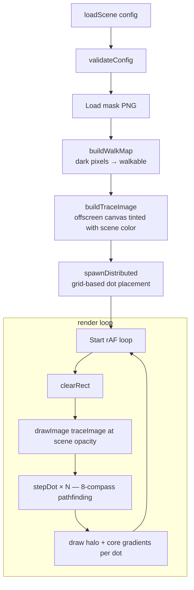
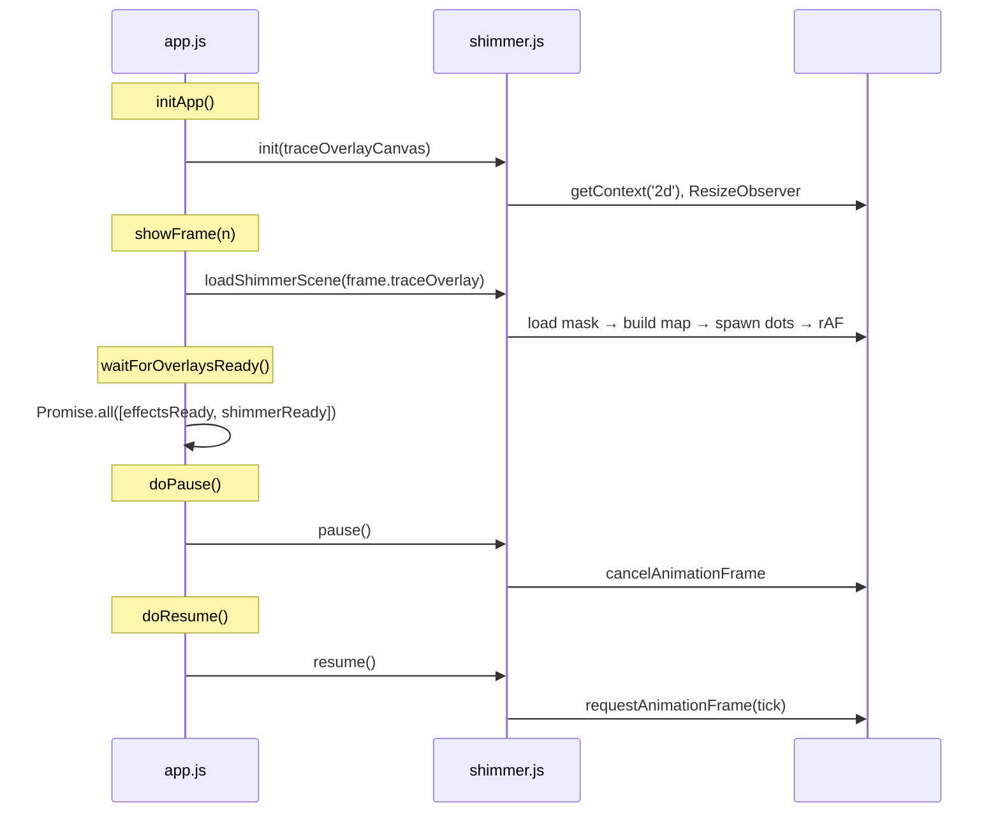

# Trace Overlay System

Circuit trace masks drawn on a dedicated Canvas 2D layer with pixel-walking
dots that travel along walkable paths. The effect is purely decorative — the
canvas is `aria-hidden="true"` and carries no semantic content. When reduced
motion is active, dots freeze in place and pulse at a fixed alpha.

## Layer Stack

```
#scene-stage (position: relative container)
├─ #scene-canvas      Canvas 2D   scene images, cover-fit
├─ #effects-canvas    PixiJS/WebGL procedural pixel effects
├─ #trace-overlay     Canvas 2D   circuit traces + walking dots ← this system
├─ .narration-layer   DOM         ghost-drift text
└─ DOM controls       DOM         dots bar, buttons, captions
```

`#trace-overlay` uses `mix-blend-mode: screen` (CSS, not canvas composite
operation) so the warm trace lines add to the scene image underneath without
obscuring dark areas. GSAP fades the entire `#scene-stage` container during
transitions — all layers fade together.

## Module Design

`shimmer.js` is a leaf module with zero cross-imports. It receives config via
`loadScene()`, manages its own canvas and `requestAnimationFrame` loop, and
knows nothing about frame ordering, audio, or DOM content.

```
app.js ──loadScene(config)──► shimmer.js ──drawImage──► #trace-overlay canvas
         pause/resume
```

## Public API

```javascript
init(canvasEl)        // Acquire 2D context, set up ResizeObserver, listen for
                      // prefers-reduced-motion changes.

loadScene(config)     // Async. Load mask, build walk map, generate trace image,
                      // spawn dots, start rAF. Pass null to clear the overlay.
                      // Generation counter guards against stale async completions.

pause()               // Cancel rAF, freeze all animation state.

resume()              // Restart rAF if walk map exists.

destroy()             // Increment generation, cancel rAF, disconnect observer,
                      // null all state. Safe to call multiple times.
```

## Per-Scene Config

Each frame in `scenes.json` carries a `traceOverlay` object (or `null` for
frames without traces):

```jsonc
"traceOverlay": {
  "mask": "assets/masks/mask-01-seam-circuit-41940702.png",  // required
  "opacity": 0.2,             // required, 0.0–1.0
  "color": [180, 155, 100],   // optional, defaults to [232, 200, 120]
  "dotCount": 12,             // optional, defaults to 15
  "dotSpeed": 0.8             // optional, defaults to 0.8
}
```

### Validation Rules

| Field      | Rule                                                                  |
| ---------- | --------------------------------------------------------------------- |
| `opacity`  | Required float 0.0–1.0                                                |
| `mask`     | Required string, relative path to PNG                                 |
| `color`    | `[r, g, b]`, must be warm-toned (R dominant, B < 0.65 x R)           |
| `dotCount` | Non-negative integer                                                  |
| `dotSpeed` | Non-negative float (0 = no movement, static trace only)               |

All validation errors throw synchronously inside `loadScene()` before any
async work begins.

## Rendering Pipeline

Five stages run per scene load, then a continuous render loop:



### Walk Map Construction

The mask PNG is drawn onto a temporary canvas and its pixel data is read.
Each pixel is classified:

```
luminance = 0.299R + 0.587G + 0.114B
walkable  = luminance < 128 AND alpha > 128
```

Results are stored in a `Uint8Array` (binary map) and an indexed position
array for O(1) random spawn access.

### Trace Image Cache

An offscreen canvas the size of the mask. Every walkable pixel is written with
the scene's `activeColor` at a fixed alpha of 0.25. This is drawn once per
scene load and reused every frame via a single `drawImage()` call.

### Dot Pathfinding

Each dot walks the mask using 8-compass direction vectors (normalized). Per
frame:

1. Advance position by `speed * direction`.
2. Every 24 frames: re-evaluate direction via `findBestDirection()`. Scan up
   to 25 pixels ahead in each direction (`countRunway`). Choose the longest
   runway. Directions with dot-product < -0.3 against current heading are
   penalized to prevent backtracking.
3. On dead end: attempt one redirect (runway > 4). If no viable direction
   exists, respawn at a random walkable position.
4. On `maxLife` reached (800–2000 frames): respawn.

Per-dot speed varies: `activeDotSpeed * (0.5 + random * 1.0)`.

## Integration with app.js



`app.shimmerReady` stores the promise from `loadShimmerScene()`.
`waitForOverlaysReady()` gates the GSAP fade-in on both effects and shimmer
load completion (800ms timeout).

## Rendering Constants

```
DOT_COUNT       = 15           default simultaneous dots
DOT_RADIUS      = 6            base radius in mask-space pixels
DOT_SPEED       = 0.8          pixels per frame
DEFAULT_COLOR   = [232,200,120] amber fallback
TRACE_ALPHA     = 0.25         static trace image alpha
DOT_ALPHA_BOOST = 2.5          min(1, opacity * boost) * pulse
PULSE_FREQ      = 0.0015       ~4.2s full sin() cycle
WALK_RADIUS     = 3            pixel tolerance for walkability checks
LOOKAHEAD       = 25           forward scan distance for direction picking
```

### Dot Rendering

Each dot draws two concentric radial gradients:

1. **Halo** (radius = DOT_RADIUS x 7): scene color fading to transparent.
   Three color stops at 0, 0.35, 1.0.
2. **Core** (radius = DOT_RADIUS x 2): white center transitioning to scene
   color then transparent. Three color stops at 0, 0.4, 1.0.

Alpha for both gradients is modulated by a per-dot pulse:

```
wave  = 0.5 + 0.5 * sin(time * PULSE_FREQ + dot.phase)
pulse = reducedMotion ? 0.6 : 0.1 + 0.9 * wave
alpha = min(1, opacity * DOT_ALPHA_BOOST) * pulse
```

## Reduced Motion

When `prefers-reduced-motion: reduce` is active:

- `stepDot()` is skipped — dots stay at spawn positions.
- Pulse is fixed at 0.6 instead of oscillating.
- Trace image still renders at scene opacity.
- Result: warm circuit lines with stationary soft glows, no movement or
  flicker.

A `matchMedia` listener updates the `reducedMotion` flag on system preference
changes mid-session.

## Mask Authoring

Masks are PNGs with dark strokes on a transparent or white background. Dark
pixels (luminance < 128, alpha > 128) become walkable paths. The masks are
painted in an image editor over the scene reference image, then exported to
`public/assets/masks/`.

### Asset Naming (ADR-010)

All mask filenames carry an 8-character SHA-256 content hash suffix:

```
mask-01-seam-circuit-41940702.png
│    │   │     │       └── content hash
│    │   │     └────────── mask type (circuit, diamond, heat, etc.)
│    │   └──────────────── scene name
│    └──────────────────── scene number
└───────────────────────── prefix
```

When updating a mask: regenerate the hash (`shasum -a 256 <file> | cut -c1-8`),
rename the file, and update the reference in `scenes.json`.

## Performance

**Per-frame cost** (15 dots, 1920x1080):

- `drawImage(traceImage)`: ~0.5ms
- 30 radial gradient fills (2 per dot): ~1–2ms
- 8-direction pathfinding lookups: <0.1ms
- **Total: <3ms** within 60fps budget

**One-time per scene load:**

- Mask image network fetch: hidden behind GSAP scene fade
- Walk map build (pixel read + classify): 5–15ms
- Trace image generation (offscreen pixel write): 2–5ms

**Early exit:** If opacity is 0 or no walk map exists, `render()` clears the
canvas and returns (~0.1ms).

## Error Handling

- Mask load failure: `loadScene()` rejects with "Failed to load mask".
  `app.js` catches and logs, experience continues without trace overlay.
- Generation guard: If a newer `loadScene()` call arrives before the current
  one completes, the stale load is discarded on resolution (generation counter
  mismatch).
- `destroy()` is idempotent — safe to call multiple times.
